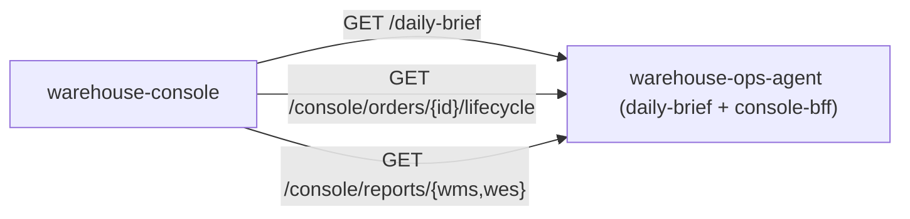

# Cross-cutting screens

Four screens exist because no single bounded-context remote can answer
them on its own: **Floor**, **Order Lifecycle** and the **WMS/WES report
dashboards**. All of them are answered by `warehouse-ops-agent`'s HTTP
server — Floor by its `GET /daily-brief` read model, the other three by the
`console-bff` routes added to that same server (see that repo's ADR-0002 and
ADR-0003) rather than a separate BFF process or a shared database. The shell
reaches it at `<apiOrigin>/api/warehouse-ops-agent` (Kong, in the cluster).

Which contexts the BFF fans out to for each screen is `warehouse-ops-agent`'s
concern, not this shell's: the lifecycle trace calls order-management,
inventory-storage, wes-work-planning and fulfillment-execution; the WMS
dashboard reads the analytics reports of order-management, inventory-storage
and facility-layout; the WES dashboard those of wes-work-planning,
fulfillment-execution, workforce-management and labor-performance.

## Floor

The console's landing screen (`/`), polling `GET /daily-brief` — every
monitored path across every site, and what needs attention first. Every
alarm colour comes from a flag the backend computed; the shell carries no
thresholds of its own, and a missing reading renders as missing, never as a
calm zero.

## Order Lifecycle

Traces one order across the four services that touch it: order-management →
inventory-storage → wes-work-planning → fulfillment-execution. The console
renders whatever stage/state shape the BFF returns; it does not reinterpret
domain meaning (this shell is a downstream **Conformist** to the BFF's
Published Language).

## WMS / WES dashboards

Both read one section-oriented envelope
(`GET /console/reports/{wms,wes}?from=&to=`, default trailing 24h) and render
each section with the ui-kit's chart primitives, chosen by the section's own
`chartKind`.

These are **eventually-consistent analytical projections, not live reads** —
every card carries a `FreshnessBadge` so staleness is shown, never hidden. A
section whose upstream is degraded arrives as `available: false` and renders
as a single "data unavailable" card; the rest of the dashboard still shows
its real numbers. Only a whole-request failure produces a dashboard-level
error state.

This graceful-degradation contract is exercised end-to-end by
`npm run verify:dashboards` (see [Getting started](../overview/getting-started.md)),
which drives all three states — fully available, one section degraded, and a
whole-request failure — against a stubbed `console-bff`.
