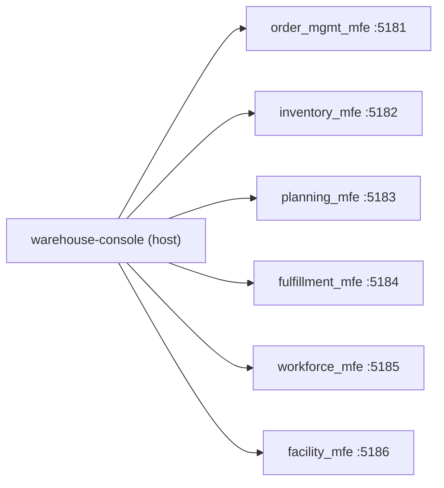

# Module Federation

This app is the federation **host** (`@module-federation/vite`); each of the
six remotes is built and deployed independently by its own bounded-context
repo.



## Shared singletons

`react`, `react-dom`, `react-router-dom`, `@warehouse/ui-kit` are all shared
as singletons — a version mismatch on any of these fails loudly (React
throws on invalid hook state) rather than silently double-loading React and
producing hard-to-debug UI bugs.

## The lazy-loading rule

Each remote's `lazy()` call **must** be created exactly once, at module
scope, in `App.tsx` — never inside a component render:

```tsx
// correct: module scope, evaluated once
const FacilityRemote = lazy(() => import("facility_mfe/App"));

function Shell() {
  return <FacilityRemote />; // fine to reference the constant every render
}
```

Calling `lazy()` inside a render function remounts the remote on every parent
re-render — which happens on every navigation via `useLocation` — re-triggering
its Module Federation fetch and losing any internal state the remote was
holding. `RemoteBoundary` wraps every remote in a `Suspense` boundary (loading
skeleton) and an error boundary, so a remote that is down or broken renders an
inline "unavailable" card instead of white-screening the whole console.

## No shared business logic

Nothing in this repo talks to any bounded context's storage or business
rules directly. If a remote's screen needs data, it fetches it from its own
service's REST API — the shell's only job is routing to the right remote and
handling the two cross-cutting screens (see
[Cross-cutting screens](./cross-cutting-screens.md)) that no single remote can
answer.
