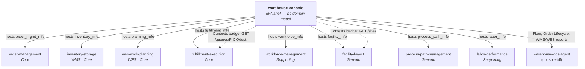

# Context map

`warehouse-console` is not a bounded context — it has no domain model, no
aggregates, no persistence. It is the fleet's shared **composition root**:
a Module Federation host plus a thin read layer over `console-bff`.

Solid "hosts" edges are Module Federation hosting; the dotted edges are the
only two REST reads the shell makes to a bounded context directly (the
Contexts launchpad's live badges). network-fulfillment has no remote and no
console screen, so it does not appear here.

## Relationship to each remote

For the eight bounded-context remotes, the relationship is **hosting**:
this shell lazy-loads each remote's independently-built bundle and gives it a
route. The one exception is the Contexts launchpad, which polls two read
endpoints directly for its tile badges: fulfillment-execution's
`GET /queues/PICK/depth` and facility-layout's `GET /sites`. It never reaches into a remote's business logic, and a remote never
reaches into this shell's — the only shared surface is
`@warehouse/ui-kit` (design tokens/components) and the singleton libraries
(`react`, `react-dom`, `react-router-dom`).

## Relationship to `warehouse-ops-agent`

For the cross-cutting screens (Floor via `GET /daily-brief`; Order Lifecycle
and the WMS/WES dashboards via `console-bff`), this shell is a downstream
**Conformist** to `warehouse-ops-agent` — it renders whatever shape the agent
publishes and does not reinterpret domain meaning. See
[Cross-cutting screens](../architecture/cross-cutting-screens.md) and
`warehouse-ops-agent`'s own ADR-0002 and ADR-0003 for why the BFF lives
there rather than as a separate service.

## No shared database, ever

Every cross-service view this shell renders goes through a REST API call at
`<apiOrigin>/api/<context>` (Kong, `http://localhost:8000`, in the kind
cluster) — to `warehouse-ops-agent` for the cross-cutting screens, and to
fulfillment-execution and facility-layout for the two launchpad badges. There is no database this repo
reads from directly, and there never will be.
