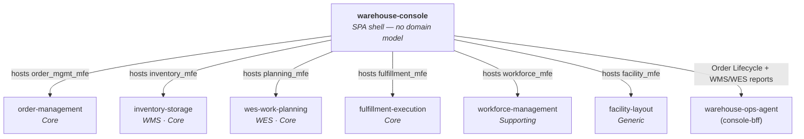

# Context map

`warehouse-console` is not a bounded context — it has no domain model, no
aggregates, no persistence. It is the fleet's shared **composition root**:
a Module Federation host plus a thin read layer over `console-bff`.

## Relationship to each remote

For the six bounded-context remotes, the relationship is purely **hosting**:
this shell lazy-loads each remote's independently-built bundle and gives it a
route. It never reaches into a remote's business logic, and a remote never
reaches into this shell's — the only shared surface is
`@warehouse/ui-kit` (design tokens/components) and the singleton libraries
(`react`, `react-dom`, `react-router-dom`).

## Relationship to `warehouse-ops-agent`

For the two cross-cutting screens (Order Lifecycle, WMS/WES dashboards), this
shell is a downstream **Conformist** to `warehouse-ops-agent`'s `console-bff`
— it renders whatever envelope shape the BFF publishes and does not
reinterpret domain meaning. See
[Cross-cutting screens](../architecture/cross-cutting-screens.md) and
`warehouse-ops-agent`'s own ADR-0002 and ADR-0003 for why the BFF lives
there rather than as a separate service.

## No shared database, ever

Every cross-service view this shell renders goes through a REST API call —
directly to a remote's dev server in local development, or through
`console-bff` for the cross-cutting screens. There is no database this repo
reads from directly, and there never will be.
